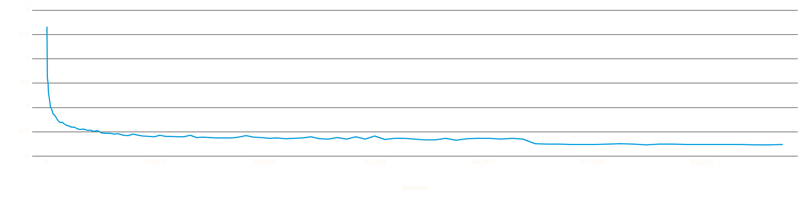
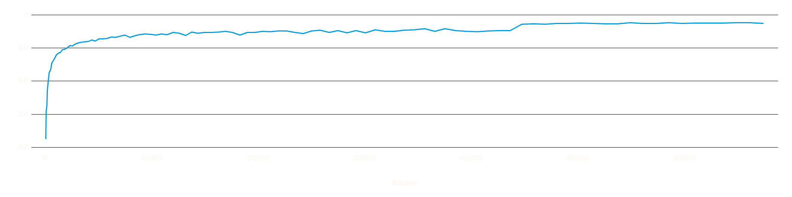
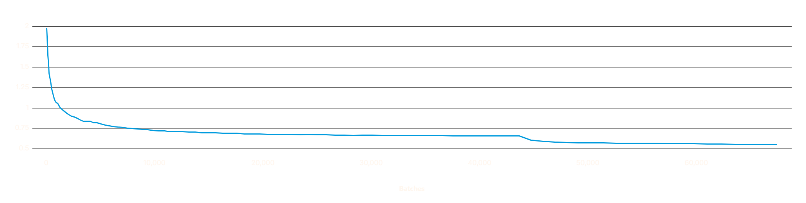
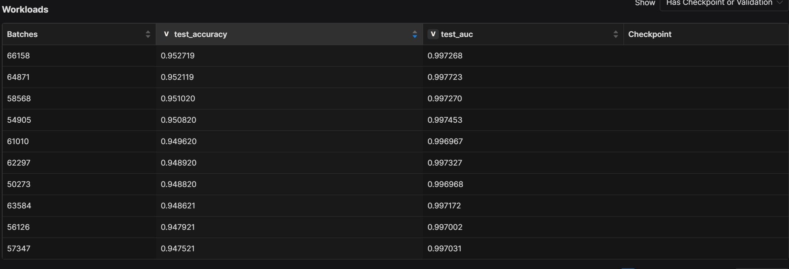

# Determined_AI_Hackathon MedMNIST Active Learning Project
This repository contains code for my submission to the Determined AI Hackathon, a project built using Determined AI's open-source, enterprise-grade platform. The project aims to demonstrate the power and versatility of Determined AI in training and managing deep learning models through a unified platform.

## Objective

The objective of this project is to explore active learning techniques for image classification within the medical imaging domain using the PathMNIST dataset. We aim to train a ResNet-50-based model that achieves high accuracy with minimal labeled data by employing uncertainty and diversity sampling strategies.

## Dataset

We used the **PathMNIST** dataset from the [MedMNIST dataset collection](https://medmnist.com/). The dataset consists of 107,180 images (split into training, validation, and testing subsets), each 28x28 pixels in size, categorized into 9 types of pathological tissues.

### Facts about PathMNIST

- **Data Modality:** Colon Pathology
- **Task:** Multi-Class (9)
- **Number of Samples:** 107,180 (89,996 training / 10,004 validation / 7,180 test)
- **Source Data:**  
  Jakob Nikolas Kather, Johannes Krisam, et al., "Predicting survival from colorectal cancer histology slides using deep learning: A retrospective multicenter study," PLOS Medicine, vol. 16, no. 1, pp. 1–22, 01 2019.
- **License:** CC BY 4.0 

## Sample Data

Below is an example image from the PathMNIST dataset:

| Image  | Label |
|--------|-------|
|  | `0` (Normal Tissue) |

**Tensor Values** (Partial):
```python
Image: tensor([[[0.7255, 0.7176, 0.7255,  ..., 0.7255, 0.7176, 0.7333],
         [0.7098, 0.7255, 0.7176,  ..., 0.5451, 0.5059, 0.4902],
         [0.7255, 0.7255, 0.7176,  ..., 0.6314, 0.6235, 0.6392],
         ...,
         [0.7098, 0.7020, 0.7333,  ..., 0.7333, 0.7255, 0.7333],
         [0.6706, 0.7020, 0.7333,  ..., 0.7333, 0.7333, 0.7333],
         [0.6863, 0.7255, 0.7333,  ..., 0.7255, 0.7333, 0.7412]],
        ...
       ])
```
The label for the sample is 
```python
Label: [0]
```

## Model Architecture

The model used is a custom ResNet-50-based architecture with modifications to fit the 28x28 image input and 9-class output of the PathMNIST dataset:
- **Base Model**: ResNet-50
- **Customizations**:
  - Initial convolution layer adjusted to accept 28x28 input images.
  - Max pooling layer removed to retain spatial dimensions.
  - Fully connected layer modified to output predictions for 9 classes.

## Training Procedure

### Training Hyperparameters

| Hyperparameter         | Value                  |
|------------------------|------------------------|
| Batch Size             | 53                    |
| Initial Labeled Size   | 3559                  |
| Learning Rate          | 0.01332344940133225    |
| MC Dropout Passes      | 6                     |
| Samples to Label       | 4430                  |
| Weight Decay           | 0.00021921795989143406 |

### Optimizer Settings

The optimizer used during training was Stochastic Gradient Descent(SDG), with the following settings and a Learning Rate Scheduler of ReduceLROnPlateau:
- `learning_rate = 0.01332344940133225`
- `momentum = 0.9`
- `weight_decay = 0.00021921795989143406`

The model was trained with float32 precision.

### Dataset
[PathMNIST](https://medmnist.com/)

### Data Augmentation
  - Random resized cropping
  - Horizontal flipping
  - Random rotations
  - Color jittering
  - Gaussian blur
  - RandAugment

### Active Learning Strategy

The active learning process was based on a mixed sampling strategy:
- **Uncertainty Sampling**: Monte Carlo (MC) dropout was used to estimate uncertainty.
- **Diversity Sampling**: K-means clustering was employed to ensure diverse samples.

## Evaluation

The model was evaluated on the validation set of PathMNIST using the following metrics: 
- **Validation Loss**: Measures the model's error on the validation dataset, with lower values indicating better performance.
- **Accuracy**: Represents the percentage of correctly classified images, demonstrating the model's ability to generalize.
- **AUC (Area Under the Curve)**: Evaluates the model's classification performance across various thresholds, with higher values indicating better separability between classes.

## Best Metrics Screenshot

The following plots illustrates the validation loss, validation accuracy, and validation auc over batches(number of iterations over the dataset) during the active learning process.

Here is a screenshot of the validation loss metric from the DeterminedAI WebUI:

- **Validation Loss**


Here is a screenshot of the validation accuracy metric from the DeterminedAI WebUI:

- **Validation Accuracy**


Here is a screenshot of the validation AUC metric from the DeterminedAI WebUI:

- **Validation AUC**


Here is a screenshot of the train loss metric from the DeterminedAI WebUI:



Here is a screenshot of the train accuracy metric from the DeterminedAI WebUI:


Here is a screenshot of the batch workload metric from the DeterminedAI WebUI:



- **Validation Accuracy/Test Accuracy**: The table shows a steady increase, indicating successful learning and convergence.
- **Validation AUC/Test AUC**: The table shows a steady increase, indicating successful learning and convergence.
- **Batches**: Represents the number of iterations over the dataset.

### Comparison with Benchmark
In the original MedMNIST v2 study, baseline models achieved an accuracy of 91.1% and a AUC of 99.0% on the PathMNIST dataset. Our implementation achieved the following results:

- **Accuracy (Best):** 94.72%
- **Loss (Best):** 0.2397
- **AUC (Best):** 99.73%

This demonstrates a 3.6% improvement over the baseline accuracy and 0.6% improvement over the baseline AUC, highlighting the effectiveness of our active learning approach combined with a custom ResNet-50 architecture.

## Running Instructions

To train the model, follow these steps:

1. Clone this repository:
   ```bash
   git clone https://github.com/AllenCheung0213/Determined_AI_Hackathon
   cd Determined_AI_Hackathon
   ```

2. Install the required dependencies:
    ```bash
    pip install -r requirements.txt
    ```

3. Install Determined:
- [Determined Quick Installation](https://docs.determined.ai/latest/get-started/basic.html#basic)

4. Run the training script:
    ```bash
    det e create config.yaml .
    ```

5. Track training metrics using the DeterminedAI WebUI.


## License

This project is licensed under the MIT License.

## Acknowledgements

- [MedMNIST Dataset](https://medmnist.com/)
- [Determined AI](https://determined.ai/)
- **Survey on Deep Active Learning**: Wang, H., Jin, Q., Li, S., Liu, S., Wang, M., & Song, Z. (2024). A comprehensive survey on deep active learning in medical image analysis. *Medical Image Analysis*, 95, 103201. [https://doi.org/10.1016/j.media.2024.103201](https://doi.org/10.1016/j.media.2024.103201)

